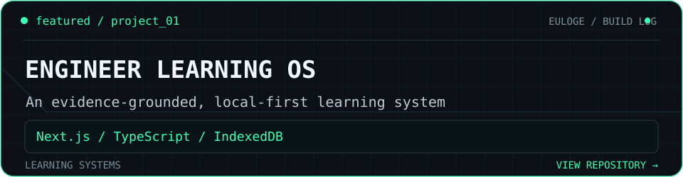
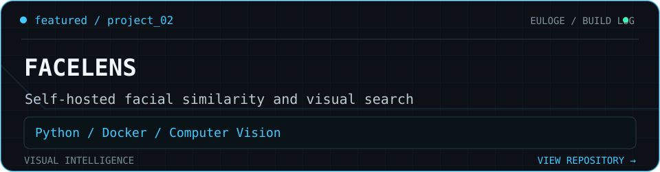
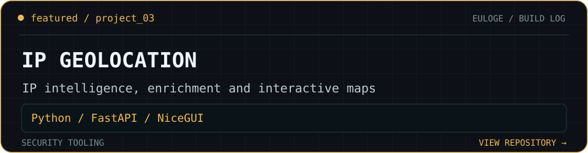
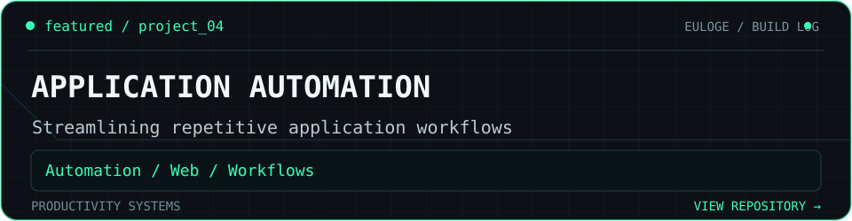

<strong>SOFTWARE ENGINEERING · AI · AUTOMATION</strong>

### `> whoami`

Computer engineering student building practical systems across **AI, automation, software engineering and security tooling**. I turn ideas into working products, then test, document and improve them.

### `> selected_work`

Four projects, four different engineering challenges. Open a card to inspect the actual repository.

**01 / Engineer Learning OS**

**Challenge:** Learning and revision need evidence, not just generated answers. **Approach:** Local-first learning workflows with document grounding, quizzes and skill tracking.

Next.js · TypeScript · IndexedDB · PDF.js

**02 / FaceLens**

**Challenge:** Image comparison tools should be controllable and usable locally. **Approach:** Self-hosted research workspace for local facial-similarity comparison.

Python · Docker · React · Computer Vision

**03 / IP Geolocation App**

**Challenge:** Network data is hard to interpret without an accessible interface. **Approach:** IP enrichment, mapping and analysis through an API-backed dashboard.

Python · FastAPI · NiceGUI · Docker

**04 / Application Automation**

**Challenge:** Repetitive application steps consume time. **Approach:** Exploration of workflows that reduce repetitive application tasks.

Automation · Web workflows

<a href="https://github.com/eulogep?tab=repositories"><code>&gt; explore_all_repositories</code></a>

### `> toolkit`

### `> engineering_principles`

### `> currently_building`

### `> connect`

