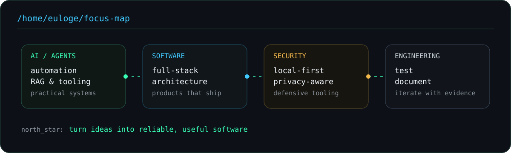
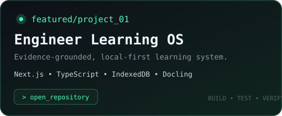
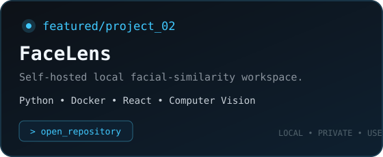
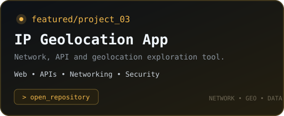
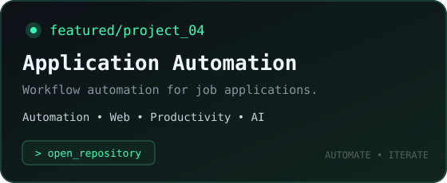
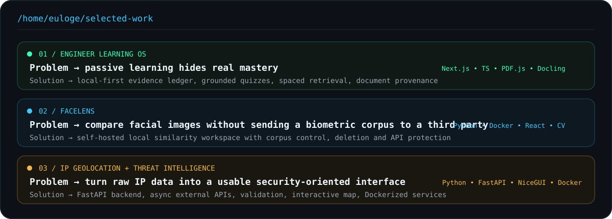
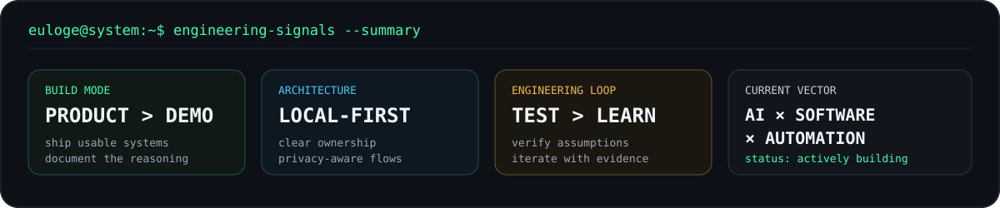
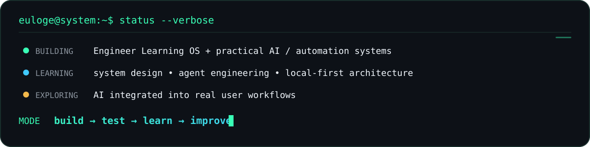
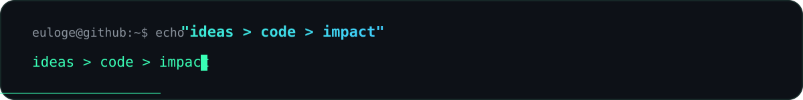

<div align="center">



<br/>

<a href="https://github.com/eulogep?tab=repositories"></a>
<a href="https://www.linkedin.com/in/euloge-junior-mabiala"></a>

</div>

## `> whoami`

```text
Student  >  Builder  >  Problem Solver

Computer engineering student building practical systems across
AI, automation, software engineering and security-oriented tooling.

I turn vague ideas into working products,
then test, document and improve them.
```



## `> featured_projects`

<table>
<tr>
<td width="50%" valign="top">
<a href="https://github.com/eulogep/Engineer-Learning-OS"></a>
</td>
<td width="50%" valign="top">
<a href="https://github.com/eulogep/FaceLens-Moteur-de-Recherche-Biom-trique-Local-Module-de-Scraping"></a>
</td>
</tr>
<tr>
<td width="50%" valign="top">
<a href="https://github.com/eulogep/IP-Geolocation-App"></a>
</td>
<td width="50%" valign="top">
<a href="https://github.com/eulogep/Automatisation-de-Candidatures-pour-Alternance"></a>
</td>
</tr>
</table>

<div align="right"><a href="https://github.com/eulogep?tab=repositories"><code>&gt; view_all_projects</code></a></div>

## `> selected_work`



## `> tech_stack`

<div align="center">

</div>

<br/>

<div align="center">


</div>

## `> engineering_signals`



## `> system_status`



## `> connect`

<div align="center">
<a href="https://github.com/eulogep"></a>
<a href="https://www.linkedin.com/in/euloge-junior-mabiala"></a>
<a href="mailto:mabialaeulogejunior@gmail.com"></a>
</div>

<br/>

